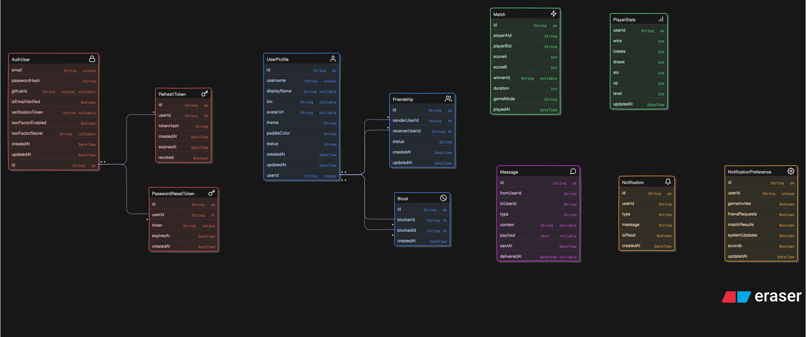

*This project has been created as part of the 42 curriculum by [login1](https://profile.intra.42.fr/users/login1), [login2](https://profile.intra.42.fr/users/login2), [login3](https://profile.intra.42.fr/users/login3).*

# ft_transcendence: Surprise

## 📝 Description

**ft_transcendence** is a full-stack, real-time multiplayer game platform focused on providing an engaging digital ping-pong experience. The platform allows users to play live matches, chat with other players, track their statistics, and manage their profiles in a robust microservices-based architecture.

**Key Features:**
- Pong game with multiple modes
- Friend system: send/accept/decline friend requests, block users, and invite friends to a game
- Secure user authentication and profile management (OAuth, 2FA)
- Real-time chat system with direct messaging
- Player statistics, leaderboards, and match history
- Fully-fledged microservices architecture with a modern, responsive web interface

### 🎮 Game Modes

| Mode | Type | Description |
| ---- | ---- | ----------- |
| **Local** | Client-side | Two players share the same keyboard on one device; no server involvement. |
| **vs AI** | Client-side | Single player challenges a computer-controlled opponent. |
| **Private Room** | Server-side | Create or join a room with a code and play against a specific friend online. |
| **Matchmaking** | Server-side | Automatic online matchmaking that pairs players of similar skill. |

## 🛠 Instructions

### Prerequisites
- **Docker** and **Docker Compose**
- **Node.js** (v22+) for local development (optional, as Docker handles the environment)
- A configured `.env` file at the root. You can copy the provided example:
  ```bash
  cp .env.example .env
  ```
- Make sure to fill in any required API keys or secrets in the `.env` file (e.g., Github OAuth credentials).

### Setup and Execution

1. **Clone the repository:**
   ```bash
   git clone --recursive https://github.com/shokdot/ft_transcendence ft_transcendence
   cd ft_transcendence
   ```

2. **Start the project using Docker (Production-like environment):**
   ```bash
   make up
   # Or directly via docker-compose
   docker-compose up --build -d
   ```

3. **Development Mode:**
   To run the project with hot-reloading for development:
   ```bash
   make dev-up
   # Or directly via docker-compose
   docker-compose -f docker-compose.dev.yml up --build
   ```

4. **Accessing the Services:**
   - **Frontend App:** `http://localhost:3010` (or as configured in `.env`)
   - **Backend API Gateway / NGINX:** `http://localhost:8080`
   - **Monitoring (Grafana):** `http://localhost:3000`

5. **Stopping the project:**
   ```bash
   make down
   # Or directly
   docker-compose down
   ```

## 📚 Resources

- **Classic References:**
  - [Next.js Documentation](https://nextjs.org/docs)
  - [Fastify Documentation](https://fastify.dev/docs/latest/)
  - [Prisma Documentation](https://www.prisma.io/docs/)
  - [Docker Documentation](https://docs.docker.com/)
  - [TypeScript Documentation](https://www.typescriptlang.org/docs/)
  - [Zod Documentation](https://zod.dev/)
  - [Tailwind CSS v4 Documentation](https://tailwindcss.com/docs)
  - [JWT Introduction](https://jwt.io/introduction)
  - [NGINX Documentation](https://nginx.org/en/docs/)
  - [Prometheus Documentation](https://prometheus.io/docs/introduction/overview/)
  - [Grafana Documentation](https://grafana.com/docs/)

- **AI Usage:**
  - AI tools (e.g., ChatGPT, GitHub Copilot) were used to assist in discovering Fastify configurations, writing repetitive boilerplate code (like Swagger schema definitions), generating initial unit test templates, and troubleshooting Docker networking setups. AI was not used to generate the core game logic or the microservices architecture design.

---

## 👥 Team Information

| Team Member | Assigned Role(s) | Responsibilities |
| ----------- | ---------------- | ---------------- |
| **[login1](https://profile.intra.42.fr/users/login1)** | Tech Lead / Developer | Overseeing microservices architecture, implementing Auth & User services. |
| **[login2](https://profile.intra.42.fr/users/login2)** | PO / Fullstack Developer | Implementing the Game engine, frontend integration, and managing project milestones. |
| **[login3](https://profile.intra.42.fr/users/login3)** | PM / Developer | Developing the Chat service, handling DevOps (Docker, Prometheus), and managing tasks. |

## 📅 Project Management

- **Task Organization:** The project was organized into weekly sprints. Tasks were divided based on domains (Frontend, Game Logic, Microservices).
- **Tools Used:** We used **Jira (Kanban boards)** to track progress and assign tasks.
- **Communication Channels:** **Telegram** for daily communication and quick ad-hoc meetings. In-person stand-ups were held twice a week.

## 💻 Technical Stack

### Frontend
- **Framework:** Next.js (v15) with React 19
- **Styling:** Tailwind CSS (v4)
- **Language:** TypeScript

### Backend (Microservices)
- **Framework:** Fastify (Node.js)
- **Language:** TypeScript
- **Services:** Auth, Chat, Game, Notification, Room, Stats, User
- **Env Validation:** Zod
- **Body/Params Validation:** JSON Schema (OpenAPI)
- **Authentication:** JWT, Fastify OAuth2, Speakeasy (2FA)

### Database
- **System:** SQLite (via Better-SQLite3) managed by Prisma ORM.
- **Justification:** SQLite was chosen per service to maintain strict microservice decoupling, ensuring that each service owns its data without complex distributed database tuning, keeping the setup lightweight and compliant with the project constraints.

### Other Technologies
- **Infrastructure:** Docker & Docker Compose
- **Routing/Gateway:** NGINX 
- **Monitoring & Logging:** Prometheus, Grafana, Logstash

### Justification for Major Choices
- **Fastify over Express:** Chosen for its performance, native async/await support, and excellent plugin ecosystem.
- **Next.js:** Provided a solid structure for building a robust SPA, with built-in optimizations and easy routing.
- **Microservices:** A modular approach was chosen to allow independent scaling, easier debugging, and clear separation of concerns among team members.

## 🗄 Database Schema

Each microservice owns its isolated SQLite database (Database-per-service pattern). The full ERD is shown below; cross-service relationships are handled logically via UUIDs rather than enforced foreign keys.



## ✨ Features List

| Feature | Team Member(s) | Description |
| ------- | -------------- | ----------- |
| **User Authentication** | [login1](https://profile.intra.42.fr/users/login1) | Secure login/registration via standard credentials or 42 Intranet OAuth. |
| **Two-Factor Authentication** | [login1](https://profile.intra.42.fr/users/login1) | Optional 2FA utilizing Google Authenticator compatibility. |
| **Live Multiplayer Game** | [login2](https://profile.intra.42.fr/users/login2) | Pong with local, AI, private room, and matchmaking modes. |
| **Chat functionality** | [login3](https://profile.intra.42.fr/users/login3) | Public/private channels, direct messaging, and blocking capabilities. |
| **Live Notifications** | [login3](https://profile.intra.42.fr/users/login3) | Real-time alerts for game invites and friend requests. |
| **User Profiles & Stats** | [login1](https://profile.intra.42.fr/users/login1), [login2](https://profile.intra.42.fr/users/login2) | Detailed match history, win/loss tracking, and profile page. |

## 🧩 Modules

| Module Name | Type / Points | Justification & Implementation | Team Member(s) |
| ----------- | ------------- | ------------------------------ | -------------- |
| **Use a Framework (Frontend + Backend)** | Major (2pts) | Frontend: **Next.js 15 + React 19** (SPA, file-based routing, built-in optimizations). Backend: **Fastify** (Node.js) across all microservices — high-performance, schema-validated, with a rich plugin ecosystem. Next.js counts as both since its frontend and backend capabilities are fully utilized. | [login1](https://profile.intra.42.fr/users/login1), [login2](https://profile.intra.42.fr/users/login2) |
| **Real-Time Features (WebSockets)** | Major (2pts) | WebSockets are used across Chat, Game, and Notification services for live bidirectional communication — enabling real-time messaging, game state sync, and instant event delivery. Connection/disconnection is handled gracefully with reconnection logic on the frontend. | [login2](https://profile.intra.42.fr/users/login2), [login3](https://profile.intra.42.fr/users/login3) |
| **User Interaction** | Major (2pts) | Users can interact via a real-time **chat system** (send/receive messages), view detailed **user profiles** (stats, avatar, match history), and manage a **friends system** (add/remove friends, view friends list, block users). | [login1](https://profile.intra.42.fr/users/login1), [login3](https://profile.intra.42.fr/users/login3) |
| **Public API** | Major (2pts) | A secured public API with **API key authentication**, **rate limiting**, **Swagger/OpenAPI documentation**, and at least 5 endpoints (GET, POST, PUT, DELETE) exposing user stats, match history, leaderboard, profile info, and friendship data. | [login1](https://profile.intra.42.fr/users/login1) |
| **Standard User Management & Authentication** | Major (2pts) | Full user lifecycle: profile info updates, avatar upload (with default), friend system with online status, and a dedicated profile page displaying user information, stats, and match history. | [login1](https://profile.intra.42.fr/users/login1) |
| **Advanced Permissions System** | Major (2pts) | Full CRUD on users, roles management (admin, user, guest, moderator), and role-based views and actions throughout the platform. | [login1](https://profile.intra.42.fr/users/login1) |
| **AI Opponent** | Major (2pts) | A challenging AI opponent that simulates human-like behavior (not perfect play) and can use any enabled game customization options. Implementation approach is explained and documented for evaluation. | [login2](https://profile.intra.42.fr/users/login2) |
| **Web-Based Multiplayer Game** | Major (2pts) | A complete browser-based Pong game with clear rules, win/loss conditions, and live multiplayer support. Players can compete in real-time matches with a 2D game engine running server-side. | [login2](https://profile.intra.42.fr/users/login2) |
| **Remote Players** | Major (2pts) | Two players on separate computers can play the same game in real-time. Network latency and disconnections are handled gracefully with reconnection logic and smooth UX during remote gameplay. | [login2](https://profile.intra.42.fr/users/login2) |
| **Infrastructure for Log Management (ELK)** | Major (2pts) | Elasticsearch stores and indexes logs, Logstash collects and transforms them, and Kibana provides visualization dashboards for monitoring application behavior across all microservices. | [login3](https://profile.intra.42.fr/users/login3) |
| **Monitoring System (Prometheus + Grafana)** | Major (2pts) | Prometheus collects metrics via configured exporters across all microservices. Custom Grafana dashboards visualize backend health, traffic, and performance. Alerting rules and secured access are configured. | [login3](https://profile.intra.42.fr/users/login3) |
| **Backend as Microservices** | Major (2pts) | The backend is decomposed into loosely-coupled services (Auth, Chat, Game, Notification, Room, Stats, User), each with a single responsibility, communicating via REST APIs through an NGINX API gateway. | [login1](https://profile.intra.42.fr/users/login1) |
| **Remote Authentication (OAuth 2.0)** | Minor (1pt) | OAuth 2.0 integration with **42 Intranet** allowing users to log in using their existing 42 credentials. Token exchange and session management are handled securely. | [login1](https://profile.intra.42.fr/users/login1) |
| **Two-Factor Authentication (2FA)** | Minor (1pt) | TOTP-based 2FA implemented using **Speakeasy**, compatible with Google Authenticator. Users can enable/disable 2FA from their profile settings. | [login1](https://profile.intra.42.fr/users/login1) |
| **Game Statistics & Match History** | Minor (1pt) | Tracks wins, losses, ranking, and level per user. Displays full match history (1v1 results, dates, opponents), achievements, progression milestones, and a global leaderboard. | [login2](https://profile.intra.42.fr/users/login2) |
| **Advanced Chat Features** | Minor (1pt) | Extends the base chat with: block users from messaging, invite users to games directly from chat, game/tournament notifications, access to user profiles from chat, chat history persistence, and typing indicators. | [login3](https://profile.intra.42.fr/users/login3) |
| **Game Customization Options** | Minor (1pt) | Players can select power-ups, different maps or themes, and customizable game settings. Default options are always available. The AI opponent can utilize all customization options. | [login2](https://profile.intra.42.fr/users/login2) |
| **Use an ORM** | Minor (1pt) | **Prisma ORM** is used across all microservices to manage SQLite databases — providing type-safe queries, schema migrations, and a clean data access layer without writing raw SQL. | [login1](https://profile.intra.42.fr/users/login1) |
| **Support for Additional Browsers** | Minor (1pt) | Full compatibility with **Chrome**, **Firefox**, and **Safari**. All features tested and fixed per browser. Browser-specific limitations are documented. Consistent UI/UX is maintained across all supported browsers. | [login2](https://profile.intra.42.fr/users/login2) |

**Module Summary:**
- 🟦 **Major modules:** 12 × 2pts = **24pts**
- 🟨 **Minor modules:** 7 × 1pt = **7pts**
- 🏆 **Total Points: 31pts**

## 👤 Individual Contributions

### [login1](https://profile.intra.42.fr/users/login1)
- **Contributions:** Architected the microservices pattern, implemented the API Gateway (NGINX), and fully developed the `auth-service` and `user-service`.
- **Challenges:** Dealing with cross-origin requests (CORS) across multiple Docker containers and sharing authentication state securely.
- **Solutions:** Implemented an API gateway to unify traffic and enforced strict JWT validation with HttpOnly cookies.

### [login2](https://profile.intra.42.fr/users/login2)
- **Contributions:** Built the primary Next.js Frontend application, the game loop, and the physics engine inside the `game-service`.
- **Challenges:** Ensuring the ball physics were perfectly synced between the server and both clients without stuttering.
- **Solutions:** Implemented a client-side prediction algorithm combined with server-authoritative state reconciliation.

### [login3](https://profile.intra.42.fr/users/login3)
- **Contributions:** Set up the global Docker environments, implemented continuous monitoring via Grafana, and developed the `chat-service` and `notification-service`.
- **Challenges:** Handling WebSocket connection drops in the chat and scaling the real-time event distribution.
- **Solutions:** Utilized Fastify's native websocket plugins and created robust reconnection logic on the frontend.
