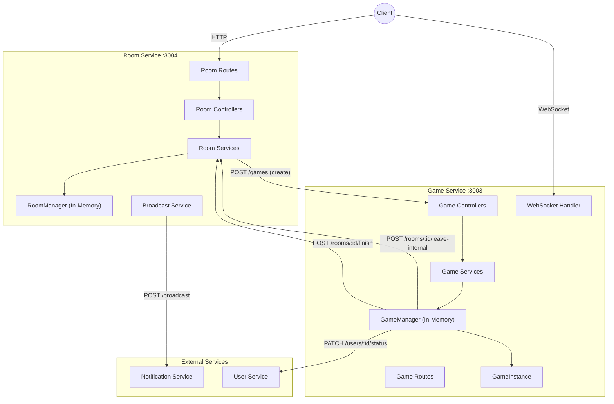
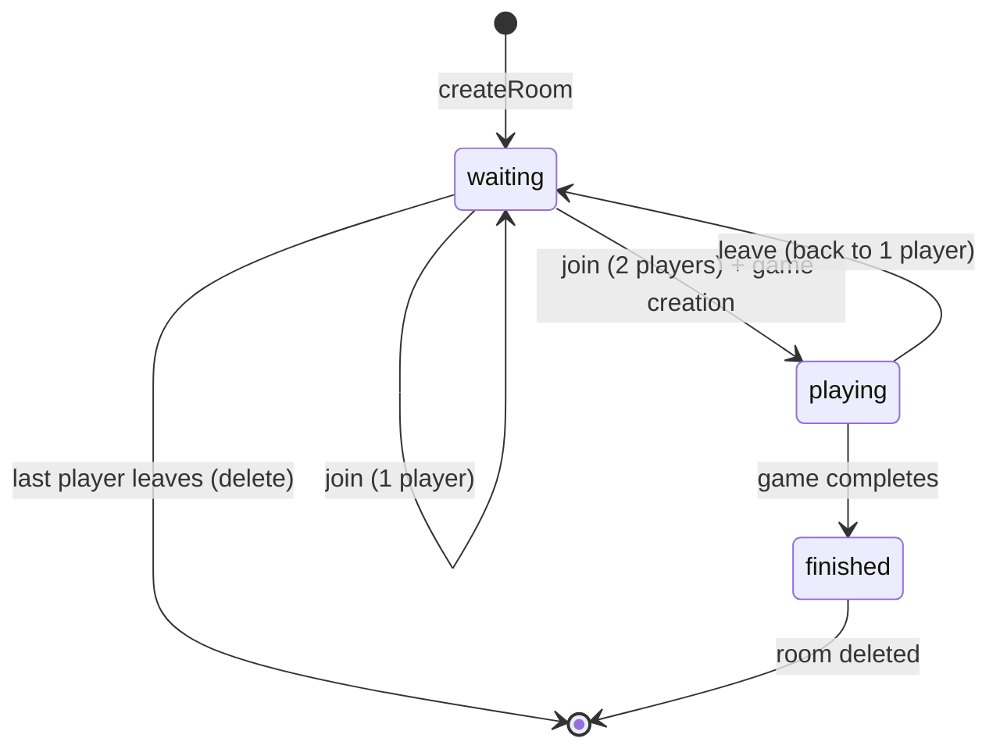
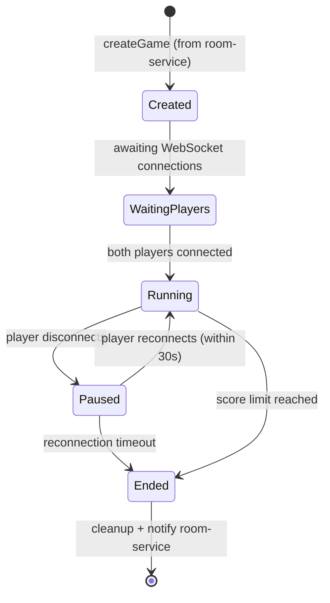
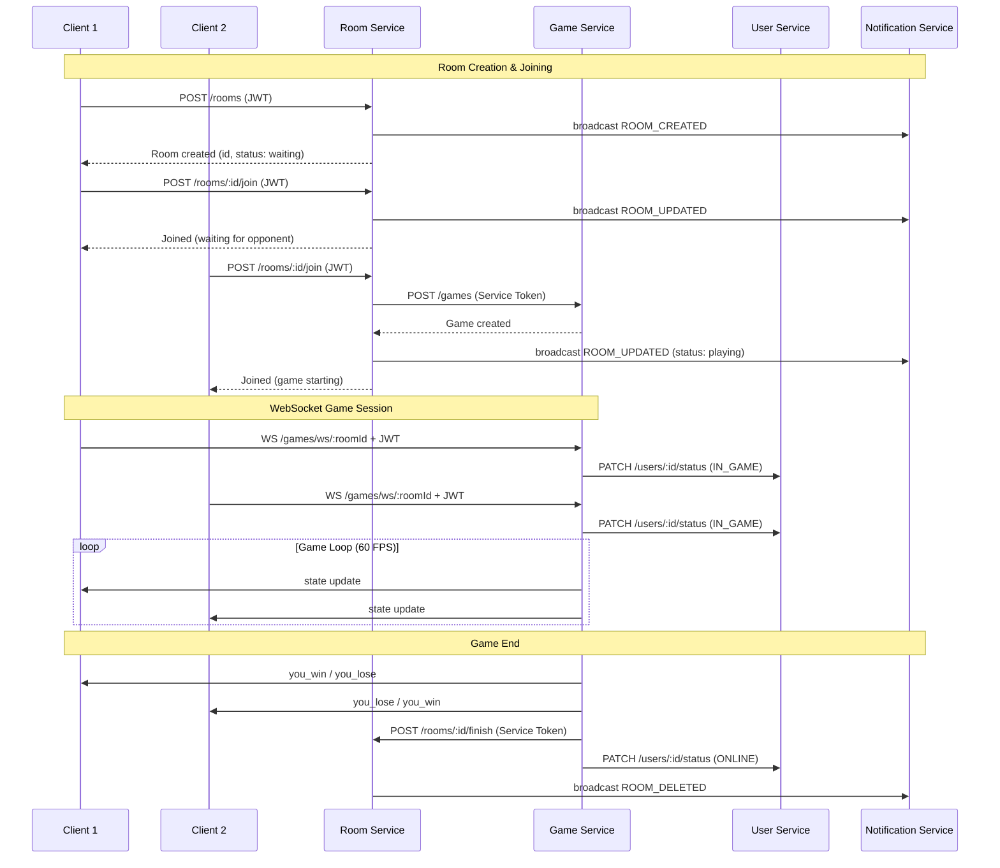

# Game Service & Room Service Integration Review

A comprehensive analysis of the `game-service` and `room-service` architecture, their individual responsibilities, and integration patterns.

---

## Architecture Overview



---

## Room Service Analysis

### Overview

| Aspect | Details |
|--------|---------|
| **Port** | 3004 |
| **Purpose** | Room lifecycle management: creation, joining, leaving, deletion |
| **Storage** | In-memory `Map<string, Room>` |
| **Auth** | User JWT for public routes, Service Token for internal routes |

### Directory Structure

```
room-service/src/
├── controllers/     # 8 HTTP handlers
├── dto/             # Request validation DTOs
├── managers/        # RoomManager singleton
├── routes/          # Route registration
├── services/        # Business logic
├── types/           # TypeScript interfaces
└── utils/           # Environment config
```

### Data Model

```typescript
interface Room {
    id: string;                              // UUID
    createdBy: string;                       // User ID
    createdAt: Date;
    status: 'waiting' | 'playing' | 'finished';
    players: string[];                       // Max 2 players
    winScore?: number;                       // Optional custom score
}
```

### Room Lifecycle States



### API Endpoints

| Method | Endpoint | Auth | Description |
|--------|----------|------|-------------|
| `GET` | `/api/v1/rooms/` | JWT | List all rooms |
| `POST` | `/api/v1/rooms/` | JWT | Create a new room |
| `DELETE` | `/api/v1/rooms/:roomId` | JWT | Delete a room |
| `POST` | `/api/v1/rooms/:roomId/join` | JWT | Join a room |
| `POST` | `/api/v1/rooms/:roomId/leave` | JWT | Leave a room |
| `POST` | `/api/v1/rooms/:roomId/leave-internal` | **Service Token** | Internal leave (from game-service) |
| `POST` | `/api/v1/rooms/:roomId/finish` | **Service Token** | Mark room finished (from game-service) |

### Key Services

#### [joinRoom.service.ts](file:///Users/hen/Desktop/ft_transcendence/apps/room-service/src/services/joinRoom.service.ts)
- Validates room exists and isn't full
- Adds player to room
- **When 2 players join**: Creates game via HTTP POST to game-service
- Broadcasts room update to notification-service

#### [broadcastRoomUpdate.service.ts](file:///Users/hen/Desktop/ft_transcendence/apps/room-service/src/services/broadcastRoomUpdate.service.ts)
- Sends room events to notification-service: `ROOM_CREATED`, `ROOM_UPDATED`, `ROOM_DELETED`
- Fire-and-forget pattern (errors logged but not thrown)

---

## Game Service Analysis

### Overview

| Aspect | Details |
|--------|---------|
| **Port** | 3003 |
| **Purpose** | Real-time Pong game management with WebSocket |
| **Storage** | In-memory `Map<string, GameData>` |
| **Game Loop** | 60 FPS server-side tick rate |
| **Auth** | Service Token for HTTP, JWT for WebSocket |

### Directory Structure

```
game-service/src/
├── controllers/     # 4 HTTP handlers
├── dto/             # Request validation DTOs
├── game/            # Core game logic
│   ├── GameManager.ts   # Game orchestration
│   ├── GameInstance.ts  # Pong physics/logic
│   ├── constants.ts     # Game configuration
│   └── types.ts         # Game state types
├── routes/          # Route registration
├── services/        # Thin service layer
├── utils/           # Environment config
└── ws/              # WebSocket handler
```

### Game Constants

```typescript
// Game dimensions
const GAME_WIDTH = 800;
const GAME_HEIGHT = 600;

// Paddle settings
const PADDLE_HEIGHT = 100;
const PADDLE_WIDTH = 10;
const PADDLE_SPEED = 8;

// Ball settings
const BALL_SIZE = 10;
const BALL_SPEED = 5;

// Game settings
const TICK_RATE = 1000 / 60;  // 60 FPS
const WIN_SCORE = 11;         // Default, configurable per room
```

### Data Models

```typescript
interface GameState {
    ball: { x: number; y: number; vx: number; vy: number };
    paddle1: { y: number; moving: number };
    paddle2: { y: number; moving: number };
    score: { player1: number; player2: number };
}

interface Player {
    userId: string;
    socket: WebSocket;
    playerNumber: 1 | 2;
    isConnected: boolean;
    reconnectTimer?: NodeJS.Timeout;  // 30s reconnection window
}
```

### Game Lifecycle



### API Endpoints

| Method | Endpoint | Auth | Description |
|--------|----------|------|-------------|
| `POST` | `/api/v1/games/` | **Service Token** | Create a game (from room-service) |
| `GET` | `/api/v1/games/:roomId` | **Service Token** | Get game state |
| `DELETE` | `/api/v1/games/:roomId` | **Service Token** | Force end a game |
| `WS` | `/api/v1/games/ws/:roomId` | **JWT Bearer** | Real-time gameplay |

### WebSocket Protocol

#### Client → Server Messages
```typescript
{ direction: -1 | 0 | 1 }  // Paddle movement: up, stop, down
```

#### Server → Client Messages
```typescript
// Game state updates (60 FPS)
{ type: "state", state: GameState }

// Player events
{ type: "reconnected", state: GameState }
{ type: "game_resumed" }
{ type: "opponent_disconnected", userId: string }
{ type: "opponent_left_permanently" }

// Game end events
{ type: "you_win" }
{ type: "you_lose" }
{ type: "game_end" }
```

#### WebSocket Close Codes
| Code | Meaning |
|------|---------|
| 4003 | Room is full |
| 4004 | Game not found |
| 1008 | Authentication error |
| 1011 | Internal server error |
| 1001 | Server shutting down |

### Key Components

#### [GameManager.ts](file:///Users/hen/Desktop/ft_transcendence/apps/game-service/src/game/GameManager.ts)
**Main responsibilities:**
- Creates/deletes game instances
- Manages WebSocket player connections
- Handles player reconnection (30-second grace period)
- Broadcasts state to connected players
- Notifies room-service when games end
- Updates user status (ONLINE/IN_GAME) via user-service

#### [GameInstance.ts](file:///Users/hen/Desktop/ft_transcendence/apps/game-service/src/game/GameInstance.ts)
**Pong game logic:**
- Ball physics with wall bouncing
- Paddle collision detection
- Score tracking with configurable win limit
- Callbacks for state updates and game end

---

## Service Integration Flow

### Complete Game Flow Sequence



### Inter-Service Communication

#### Room Service → Game Service
| Trigger | Action |
|---------|--------|
| 2nd player joins room | `POST /games` with `{ roomId, winScore }` |

#### Game Service → Room Service
| Trigger | Action |
|---------|--------|
| Player leaves mid-game | `POST /rooms/:id/leave-internal` with `{ userId }` |
| Game ends (score limit or forfeit) | `POST /rooms/:id/finish` |

#### Game Service → User Service
| Trigger | Action |
|---------|--------|
| Player connects to game | `PATCH /users/:id/status` → `IN_GAME` |
| Player leaves/game ends | `PATCH /users/:id/status` → `ONLINE` |

---

## Issues & Recommendations

### Critical Issues

> [!CAUTION]
> **1. In-Memory Storage (Both Services)**
> - Both services store state in JavaScript `Map` objects
> - Server restart = complete data loss
> - No horizontal scaling possible
> - **Recommendation**: Use Redis for shared state or implement event sourcing

> [!CAUTION]
> **2. Missing Score/Winner Propagation**
> - `finishRoom.service.ts` has comment: `// stats service logic or in Game Service`
> - Game end doesn't pass winner/scores to room-service
> - **Recommendation**: Add score data to finish endpoint request body

### High Priority

> [!WARNING]
> **3. Race Condition in Game Creation**
> - In `joinRoom.service.ts`: If game creation fails, player is removed
> - But `broadcastRoomUpdate` is called regardless of success state
> - Could broadcast inconsistent state

> [!WARNING]
> **4. Missing Await in finishRoomHandler**
> ```typescript
> // Current (line 9)
> finishRoom(roomId);  // Missing await!
> 
> // Should be
> await finishRoom(roomId);
> ```

> [!WARNING]
> **5. Error Swallowing in notifyRoomService**
> - Errors are only logged, not handled
> - Could lead to room-service and game-service being out of sync

### Medium Priority

> [!IMPORTANT]
> **6. Type Safety Issues**
> - Multiple `as any` casts in room-service routes
> - Inconsistent error handling patterns

> [!IMPORTANT]
> **7. Hardcoded Reconnection Timeout**
> - 30-second timeout hardcoded in GameManager
> - Should be configurable via environment variable

> [!IMPORTANT]
> **8. No Game State Validation**
> - Room-service creates game without verifying game-service response
> - Could proceed even if game creation returned error status

### Low Priority

> [!NOTE]
> **9. Inconsistent Controller Patterns**
> - Some controllers are `async`, others are not
> - `forceEndGameHandler` is sync but should be async for consistency

> [!NOTE]
> **10. Missing Rate Limiting**
> - No protection against WebSocket message flooding
> - No rate limiting on room creation

---

## Code Quality Assessment

### Strengths

| Aspect | Rating | Notes |
|--------|--------|-------|
| **Separation of Concerns** | ⭐⭐⭐⭐ | Clear controller → service → manager layers |
| **TypeScript Usage** | ⭐⭐⭐ | Types defined, some `any` casts present |
| **Error Handling** | ⭐⭐⭐ | AppError pattern used, could be more consistent |
| **WebSocket Implementation** | ⭐⭐⭐⭐ | Reconnection logic, proper cleanup |
| **Game Physics** | ⭐⭐⭐⭐ | Clean implementation, 60 FPS server-authoritative |
| **Inter-service Auth** | ⭐⭐⭐⭐ | Service tokens with middleware protection |
| **Environment Config** | ⭐⭐⭐⭐⭐ | Zod validation for all env vars |

### Areas for Improvement

| Aspect | Rating | Notes |
|--------|--------|-------|
| **Data Persistence** | ⭐ | In-memory only |
| **Horizontal Scaling** | ⭐ | Not possible with current architecture |
| **Test Coverage** | ❓ | No tests found |
| **Logging** | ⭐⭐ | Basic console.error usage |
| **API Documentation** | ⭐⭐ | No Swagger/OpenAPI schemas |

---

## Summary

The `game-service` and `room-service` form a well-structured microservice pair for multiplayer Pong. Room-service orchestrates the matchmaking lifecycle while game-service handles real-time gameplay via WebSocket. The integration is clean with service-token authentication for internal communication.

**Key Integration Points:**
1. Room-service triggers game creation when room is full
2. Game-service notifies room-service on player leave/game finish
3. Both services broadcast events to notification-service
4. Game-service manages user status via user-service

**Priority Improvements:**
1. Add Redis for shared state storage
2. Propagate game scores on finish
3. Add comprehensive test coverage
4. Fix async/await inconsistencies
