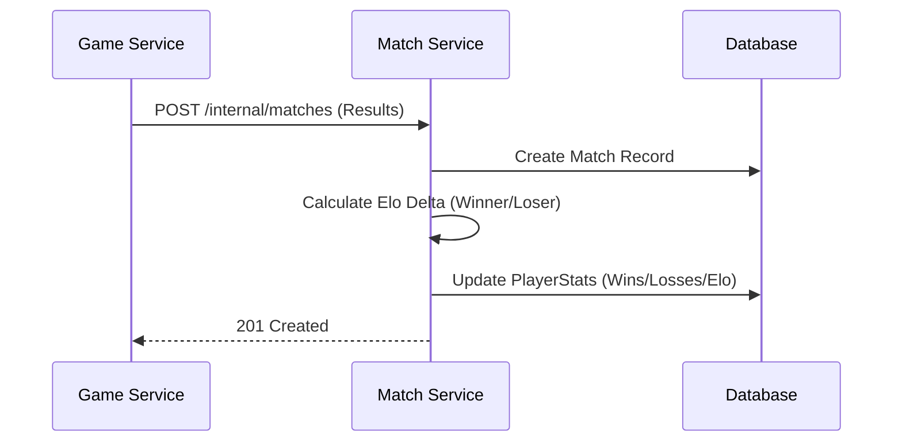

# Match & Statistics Service Documentation

The `match-service` is a microservice responsible for persisting game results, calculating player statistics (wins, losses, rank), and managing global leaderboards.

## 1. Architecture Overview

This service sits between the `game-service` and the `frontend`, acting as the source of truth for all competitive data.

### 1.1 Responsibilities
- **Match Persistence**: Storing every completed game's details (players, score, duration).
- **Stat Aggregation**: Maintaining live counters for wins, losses, and draws.
- **Ranking System**: Calculating Elo ratings or XP-based levels.
- **Leaderboards**: Providing optimized queries for global and regional rankings.

---

## 2. Data Models (Prisma)

The service uses a relational database (e.g., PostgreSQL or SQLite) to ensure data integrity for match results.

```prisma
// schema.prisma

model Match {
  id          String   @id @default(uuid())
  playerAId   String   // User UUID from user-service
  playerBId   String   // User UUID from user-service
  scoreA      Int      @default(0)
  scoreB      Int      @default(0)
  winnerId    String?  // UUID of the winner or null if draw
  gameMode    String   @default("CLASSIC") // "CLASSIC", "SPECIAL", "RANKED"
  duration    Int      // Duration in seconds
  playedAt    DateTime @default(now())

  @@index([playerAId])
  @@index([playerBId])
}

model PlayerStats {
  userId      String   @id // Primary Key (Matches user-service UUID)
  wins        Int      @default(0)
  losses      Int      @default(0)
  draws       Int      @default(0)
  elo         Int      @default(1000) // MMR/Elo rating
  xp          Int      @default(0)
  level       Int      @default(1)
  updatedAt   DateTime @updatedAt

  @@index([elo(sort: Desc)]) // Optimized for leaderboard queries
}
```

---

## 3. API Specification

### 3.1 Internal Endpoints (S2S)
*Protected by `SERVICE_TOKEN`*

| Method | Endpoint | Description | Payload |
| :--- | :--- | :--- | :--- |
| `POST` | `/internal/matches` | Record a finished game | `{ playerAId, playerBId, scoreA, scoreB, winnerId, gameMode, duration }` |

### 3.2 Public Endpoints
*Accessible via API Gateway / Frontend*

#### Statistics
- `GET /stats/:userId`: Fetch cumulative stats for a specific user.
- `GET /history/:userId`: Fetch list of recent matches for a user (paginated).

#### Leaderboard
- `GET /leaderboard`: Returns top 100 players sorted by `elo`.
- `GET /leaderboard/rank/:userId`: Returns the specific rank position of a user.

---

## 4. Workflows

### 4.1 Game Completion Flow



### 4.2 Ranking Logic (Elo)
When a match is recorded, the service calculates the expected outcome based on current Elo ratings:
1. **Expected Score**: `E = 1 / (1 + 10^((oppElo - myElo) / 400))`
2. **Actual Score**: `S` (1 for win, 0.5 for draw, 0 for loss)
3. **Rating Update**: `NewElo = OldElo + K * (S - E)` (where K=32)

---

## 5. Security & Performance

- **Rate Limiting**: Public endpoints are rate-limited to avoid scraping leaderboard data.
- **Horizontal Scaling**: Since processing match results is computationally light but I/O heavy, this service can easily scale horizontally.
- **Caching**: The global leaderboard can be cached in Redis with a 5-minute TTL to reduce database load.
