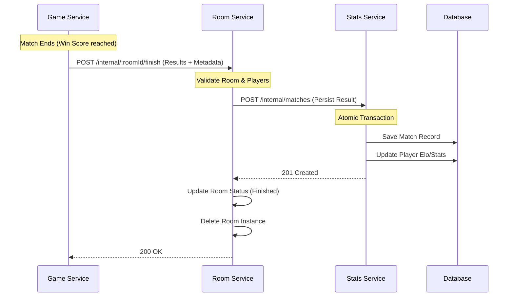

# Stats Service Integration Design

This document outlines the architectural decision for integrating the `stats-service` (or `match-service`) into the existing microservices ecosystem.

## 1. Chosen Architecture: Room Service Orchestration

The integration follows a "Chain of Responsibility" pattern where the **Room Service** acts as the orchestrator for game finalization.

### 1.1 Data Flow
`Game-Service` → `Room-Service` → `Stats-Service`

### 1.2 Sequence Diagram



---

## 2. Service Responsibilities

| Service | Primary Responsibility in Stats Flow |
| :--- | :--- |
| **Game Service** | Detecting the win condition and reporting the final score + duration to the Room Service. |
| **Room Service** | Validating that the reporting game is legitimate, combining game results with room-specific metadata (mode, rules), and triggering the persistence. |
| **Stats Service** | The "Source of Truth" for historical data. Handles all math logic (Elo/XP), database writes, and leaderboard queries. |

---

## 3. Implementation Details

### 3.1 Game Service (Trigger)
When a match completes in `GameManager.ts`, it should collect final stats and notify the Room Service:

```typescript
// apps/game-service/src/game/GameManager.ts

private async notifyRoomService(roomId: string, results: any, action: 'leave' | 'finish') {
    const path = action === 'leave' ? `${roomId}/leave-internal` : `${roomId}/finish`;
    const url = `${ROOM_SERVICE_URL}/${path}`;

    await axios.post(url, {
        winnerId: results.winnerId,
        scores: results.scores,     // e.g., { player1: 11, player2: 5 }
        duration: results.duration  // in seconds
    }, {
        headers: { 'x-service-token': SERVICE_TOKEN }
    });
}
```

### 3.2 Room Service (Orchestrator)
The `finishRoom` service receives the results, enriches them with room metadata, and forwards them to the Stats Service:

```typescript
// apps/room-service/src/services/finishRoom.service.ts

const finishRoom = async (roomId: string, gameResults: any) => {
    const room = roomManager.getRoom(roomId);
    if (!room) throw new AppError('ROOM_NOT_FOUND');

    // 1. Forward to Stats Service (Match persistence & Elo calculation)
    await axios.post(`${STATS_SERVICE_URL}/internal/matches`, {
        playerAId: room.players[0],
        playerBId: room.players[1],
        scoreA: gameResults.scores.player1,
        scoreB: gameResults.scores.player2,
        winnerId: gameResults.winnerId,
        gameMode: room.gameMode, // Metadata owned by Room Service
        duration: gameResults.duration
    }, {
        headers: { 'x-service-token': SERVICE_TOKEN }
    });

    // 2. Cleanup room state
    roomManager.deleteRoom(roomId);
    broadcastRoomUpdate('ROOM_DELETED', roomId);
}
```

### 3.3 Stats Service (Persistence)
The `Stats Service` should expose an internal endpoint that performs an atomic transaction to save the match and update player rankings:

```typescript
// apps/stats-service/src/services/recordMatch.service.ts (Proposed)

const recordMatch = async (data: MatchData) => {
    return prisma.$transaction(async (tx) => {
        // 1. Save match history
        const match = await tx.match.create({ data });

        // 2. Calculate Elo change
        const { eloA, eloB } = calculateEloDelta(data);

        // 3. Update global rankings
        await tx.playerStats.update({ 
            where: { userId: data.playerAId }, 
            data: { elo: eloA, wins: { increment: data.winnerId === data.playerAId ? 1 : 0 } }
        });
        // ... repeat for Player B
    });
}
```


---

## 4. Advantages
- **Single Responsibility**: Game Service stays focused on real-time physics.
- **Improved Security**: The Stats Service only needs to trust the Room Service.
- **Traceability**: All game life-cycle events (Create -> Join -> Start -> Finish) are centralized in the Room Service.
